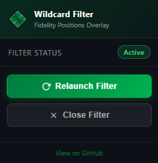

# Fidelity Positions Wildcard Filter Overlay

[](LICENSE)
[]()
[]()

An ultra-premium, see-through glassmorphic Chrome Extension and bookmarklet that inserts a wildcard-enabled live search bar directly into the **Fidelity Digital Positions** dashboard. 

It enables rapid portfolio filtering using advanced wildcard patterns and multi-term union searches (e.g. `*CIFR* & *DRAM*`), snapping inline perfectly in the Positions table header.

---

## 📥 Direct Downloads & Quick Links

* **📦 [Download Extension ZIP](https://github.com/teeesss/fidelity_filter/archive/refs/heads/master.zip)** – Click to download the repository as a ZIP file. Extract it and load the `extension/` folder directly as an unpacked developer extension in Chrome (`chrome://extensions/`). *(Recommended — runs automatically on every visit)*

* **🚀 [Download Bookmarklet (dist/bookmarklet.txt)](https://raw.githubusercontent.com/teeesss/fidelity_filter/master/dist/bookmarklet.txt)** – Open this file, copy the single-line `javascript:...` code, and paste it directly into your browser bookmark's URL box. *(Alternative to the extension — no install required)*

> [!NOTE]
> ### 🔖 What is a Bookmarklet?
> A **bookmarklet** is a regular browser bookmark whose URL contains JavaScript code instead of a web address.
> When you click it, it runs that code **on whatever page you're currently viewing** — no extensions, no installs, no permissions required.
>
> **It is 100% separate from the Chrome Extension.** You only need one or the other:
> | | Chrome Extension | Bookmarklet |
> |---|---|---|
> | **Activation** | Automatic — loads on every Fidelity visit | Manual — click the bookmark each time |
> | **Install** | Requires Developer Mode in Chrome | Just paste into a bookmark URL |
> | **Works in other browsers** | Chrome only | Any browser (Firefox, Edge, Safari, etc.) |
> | **Persists across reloads** | ✅ Yes | ❌ Must re-click after page reload |

---

## 🚀 Key Features

* **Glassmorphic Micro-UI:** Extremely polished design utilizing modern see-through glass aesthetics (`rgba(255, 255, 255, 0.05)` background, a 20px backdrop blur, a fine crisp dark outline, and `4px` rounded corners).
* **Relative Position Snapping:** Dynamically finds the native search buttons container (`.posweb-grid_top-buttons-search-container`) and mounts itself inline with a relative offset (`top: -50px`) so it feels completely native.
* **Union Multi-Term Search (`&`):** Allows combining search patterns to view multiple sets of rows simultaneously. Typing `*CIFR* & DR` matches any row containing `CIFR` **OR** `DR` (e.g., DRAM), enabling users to monitor multiple positions concurrently.
* **Wildcard Parsing (`*` and `?`):** Seamless support for `*` (zero-or-more characters) and `?` (exactly one character) standard wildcard filters.
* **Deep Shadow-DOM Traversal:** Automatically pierces all shadow roots and nested containers recursively to gather all textual content inside the rows.
* **ag-Grid Split Column Stacking:** Groups rows by their grid coordinate index and dynamically updates active translation heights (`translateY` transforms or `top` rules) so column groupings stack flush on top of one another when elements are hidden.

## 📸 Relaunch Filter Button



**What it does:**  
When the overlay is closed (via the **✕** button), clicking **Relaunch Filter** in the extension’s toolbar popup instantly re‑injects the filter UI on the current Fidelity page – no full page refresh needed. This gives you a quick way to bring the filter back after closing it.

*The image shows the Chrome extension toolbar button (diamond icon) opening the popup, then the “Relaunch Filter” button inside the popup.*

------

## 🛠️ Tech Stack & Architecture

1. **Frontend Core:** Pure Vanilla JS (ES6+) and CSS3. 
2. **Matching Engine (`src/matching.js`):** Lightweight, regex-driven parser compiling wildcard patterns and splitting them by `&` to run a logical `some` evaluation across active text content.
3. **Overlay & Rendering (`src/overlay.js`):** Deep DOM recursive text scraper, ag-Grid layout translator, and coordinate stacker.
4. **Lightweight Bundlers:** Compiles imports and inlines styling into separate outputs:
   * **Bookmarklet compiler (`src/build.js`):** Minifies and URL-encodes everything into a single `javascript:...` link in `dist/bookmarklet.txt`.
   * **Chrome Extension compiler (`extension/build-extension.js`):** Bundles resources cleanly for Manifest V3 extension environments in `extension/content.js`.

---

## ⚡ Setup & Usage

### 📦 Installation

#### Method A: Chrome Extension (Recommended)
1. Download the extension ZIP file: **[Download Extension ZIP](https://github.com/teeesss/fidelity_filter/archive/refs/heads/master.zip)**.
2. Extract the downloaded `.zip` file on your computer.
3. Open Chrome and navigate to `chrome://extensions/`.
4. Enable **Developer mode** via the toggle in the top-right corner.
5. Click **Load unpacked** (top-left button) and select the **`extension`** folder inside the extracted project directory.
6. Open your [Fidelity Positions Dashboard](https://digital.fidelity.com/ftgw/digital/portfolio/positions) to see the filter box automatically snapped next to the native magnifying glass!

#### Method B: Bookmarklet
1. Open the compiled output file [dist/bookmarklet.txt](https://raw.githubusercontent.com/teeesss/fidelity_filter/master/dist/bookmarklet.txt).
2. Copy the entire single-line payload starting with `javascript:`.
3. Create a new bookmark in your browser, paste the payload into the **URL / Location** field, and save it.
4. Click the bookmark when viewing your Fidelity Positions dashboard to launch the filter.

---

## 🧠 Developer Guide & Lessons Learned

> [!WARNING]
> **Chrome Extension Caching Behavior**
> Chrome caches content scripts for unpacked extensions. If you make code modifications in `extension/content.js` or `extension/content.css`, the browser **will not** reload the extension in active tabs automatically.
> You **must** manually click the **Reload (circular arrow) icon** in `chrome://extensions/` and then reload your dashboard tab for changes to take effect.

### Union Logic on Rows
* When searching for `CIFR & DRAM`, a human expects to see *both* symbols in their rows.
* Because no individual row contains both `CIFR` and `DRAM` strings at the same time, this must be evaluated as an **`OR` (union)** filter (`terms.some(term => regex.test(text))`), rather than an `AND` filter.

---

## 🧪 Automated Testing
Run automated unit and layout integration tests:
```powershell
npm test
```
* Tests verify robust wildcard-to-regex translations, union matches, ag-Grid dynamic vertical height shifts, and target element class selectors.
